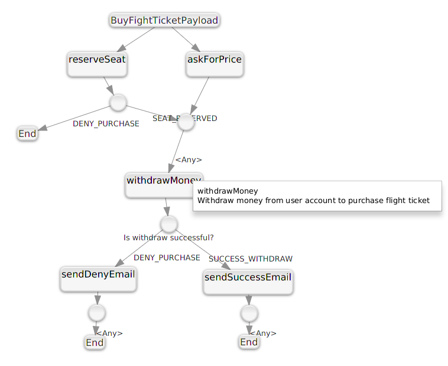

= Completable Reactor
:toc: left
:toclevels: 4
:source-highlighter: coderay

[abstract]
CompletableReactor framework makes it easier to create business flows that have concurrently running parts and complex execution branching.
[link=https://search.maven.org/search?q=g:ru.fix%20and%20a:completable-reactor-runtime]
image::https://img.shields.io/maven-central/v/ru.fix/completable-reactor-runtime.svg[]
image:https://assets-cdn.github.com/images/modules/logos_page/GitHub-Mark.png[32,32]
link:https://github.com/ru-fix/completable-reactor[]

CompletableReactor provides DSL-like builder-style API to describe business flows and visualization plugins
that parse code and displays it as an execution graph.
CompletableReactor follows code-first approach when developer writes code and IDE visualizes it in plugin window and provides ability to navigate from graph to code and backward.

Framework built on top of Fork Join Pool and CompletableFuture API.
Different JVM based languages use extension to support more suitable DSL-like API.
Currently supported DSLs are for `Java` and `Kotlin` languages.

== Motivation
link:https://docs.oracle.com/javase/8/docs/api/java/util/concurrent/CompletableFuture.html[CompletableFuture API]
with link:https://docs.oracle.com/javase/8/docs/api/java/util/concurrent/ForkJoinPool.html[ForkJoinPool]
provides ability to write asynchronous code. But sometimes business logic not as straight forward as we would like.
This leads to complex `thenApply`/`thenCompose` CompletableFuture chains that hard to read and maintain. Kotlin
link:https://kotlinlang.org/docs/reference/coroutines.html[`suspend` methods and coroutines]
slightly simplifies sequential chains, but they are still fail to clarify complexity of
unobvious conditional branching with scenarios executed in parallel.

Complex business logic with lots of branching and concurrently executing parts hard to describe using regular coding
 approach without proper visualization. One of ways to represent that branching is a graph with nodes and
 transitions.
CompletableReactor API tries to keep API as simple and possible, saves benefits of statically typed languages and in
same time provides ability for fast code parsing and visualization the execution flow.

Project goals are:

- Tool that can visualize complex concurrent code in simple and self-documented manner and can provide search and navigation capabilities.
- Code first approach: write concurrent code and then visualize/navigate through it in your favorite IDE
- Concise easy to learn DSL that enables fast source code parsing for visualization purpose
- Tracing, profiling, performance monitoring, detailed information in exceptional cases out of the box.
- Performance and lightweight

== Getting Started

=== Add CompletableReactor dependencies into your project.

.Java dependencies
* completable-reactor-runtime image:https://img.shields.io/maven-central/v/ru.fix/completable-reactor-runtime.svg[link=https://search.maven.org/search?q=g:ru.fix%20and%20a:completable-reactor-runtime]

* completable-reactor-graph image:https://img.shields.io/maven-central/v/ru.fix/completable-reactor-runtime.svg[link=https://search.maven.org/search?q=g:ru.fix%20and%20a:completable-reactor-graph]

.Kotlin dependencies
* completable-reactor-runtime image:https://img.shields.io/maven-central/v/ru.fix/completable-reactor-runtime.svg[link=https://search.maven.org/search?q=g:ru.fix%20and%20a:completable-reactor-runtime]
* completable-reactor-graph-kotlin image:https://img.shields.io/maven-central/v/ru.fix/completable-reactor-runtime.svg[link=https://search.maven.org/search?q=g:ru.fix%20and%20a:completable-reactor-graph-kotlin]

=== Install plugin into your IDE or standalone viewer
* link:https://plugins.jetbrains.com/plugin/9599-completable-reactor[Intellij Idea Plugin]
* Eclipse Plugin (TODO)
* Standalone application completable-reactor-graph-viewer-app image:https://img.shields.io/maven-central/v/ru.fix/completable-reactor-runtime.svg[link=https://search.maven.org/search?q=g:ru.fix%20AND%20a:completable-reactor-graph-viewer-app].

=== Write simple graph application
[source,java]
----
include::../completable-reactor-example/src/main/java/ru/fix/completable/reactor/example/flight/ticket/BuyFightTicketPayload.java[tags=payload]
----

[source,java]
----
include::../completable-reactor-example/src/main/java/ru/fix/completable/reactor/example/flight/ticket/BuyFlightTicketGraph.java[tags=graph]
----

[source,java]
----
include::../completable-reactor-example/src/main/java/ru/fix/completable/reactor/example/flight/ticket/BuyFlightTicketApplication.java[tags=main]
----

[source,java]
----
include::../completable-reactor-example/src/main/java/ru/fix/completable/reactor/example/flight/ticket/BuyFlightTicketGraph.java[tags=services]
----

Application output:

[source]
----
SalesDepartment: calculate current price for New York
FlightPlanner: reserve seat
Bank: withdraw money: 12.0
EmailClient: Congratulations, you have purchased a ticket.
Result: Successful purchase for 12.0
----

=== View visual representation of the Graph
* Display visual graph directly from code by `Ctrl+R` shortcut `(Tools->ReactorGraph)`
* Navigate from graph to code by double-clicking on the nodes
* Read graph description in nodes menu generated directly from code comments

=== Monitor graph execution
* Monitor graph and individual vertex performance
* Trace how graph execute through individual vertex by enabling tracing for particular payloads
* Check reactor reports about vertices that executed too long, did not complete on timeout or hang

include::completable-reactor-runtime.adoc[]

== Validation

It is possible to configure graph in a wrong way.
For example we can forgot to specify endpoints for one of branches that could lead to situation when graph execution could not complete at all.
To prevent this, during graph building process CompletableReactor apply validation procedures on Graph instance.
Validators checks that graph is consistent, have correct configuration of nodes and transitions.

== Metrics

Each graph and each vertex withing graph is being profiled by
link:https://github.com/ru-fix/aggregating-profiler[aggregating profiler]
image:https://img.shields.io/maven-central/v/ru.fix/aggregating-profiler.svg[]

All metrics names have common prefix, by default it is
----
ru.fix.completable.reactor.runtime.*
----
for example
----
ru.fix.completable.reactor.runtime.exc.AvailableSubscriptionsPayload.callsCountSum
----

There are four types of metrics:

- pld.payload-name.* - span between two point of time: when we submitted payload into reactor and when result is completed.
- exc.payload-name.* - some graphs contain detached nodes
(see <<completable-reactor-runtime.adoc, Detached Handler without Merger>>).
In such cases graph execution is continues even after result completion.
exc metric shows when whole graph execution is completes including such detached vertices.
- hndl.vertex-name.* - async handler operation execution time span
- mrg.vertex_name.* - sync merger, mutator or router operations time span

Each metric measure how many times vertex was invoked, how long it took to execute, etc.
Check out details in
link:https://github.com/ru-fix/aggregating-profiler#metrics-summary[aggregating-profiler metrics summary].

== Intellij Idea Plugin

link:https://plugins.jetbrains.com/plugin/9599-completable-reactor[]

Completable Reactor Intellij Idea plugin provides graph visualization and source code navigation within IDE.
You can jump to code using double click on graph item or by using context menu.

include::best-practice-code-convention.adoc[]

include::source-guidebook.adoc[]

== Well known problems
=== JavaFx application failed to load canberra-gtk-module.
Application starts with error  message:
----
Gtk-Message: ... Failed to load module "canberra-gtk-module"
----
Fix:

----
sudo apt-get install libcanberra-gtk-module
----